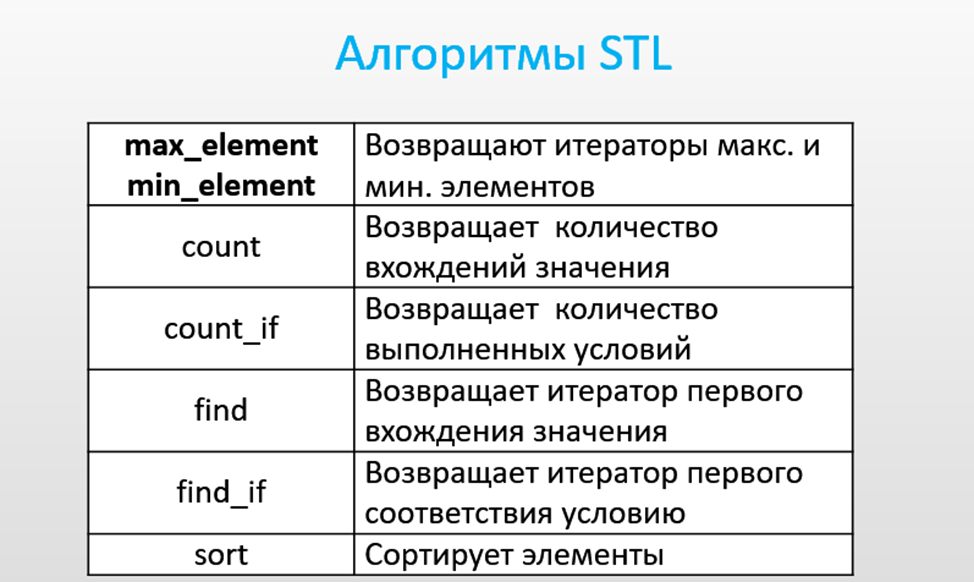

## &nbsp;&nbsp;&nbsp;&nbsp;С++. Алгоритмы для последовательных контейнеров.
 
>&nbsp;&nbsp;&nbsp;&nbsp;Глобальные функции, первыми двумя параметрами которых являются итераторы,  определяющие диапазон последовательности элементов, в котором функция работает.   
>&nbsp;&nbsp;&nbsp;&nbsp;Если это весь контейнер, то начало диапазона определяет итератор, возвращающий begin(), а конец   - end().  

>&nbsp;&nbsp;&nbsp;&nbsp;Алгоритмы работают и с обычными массивами. В этом случае первый аргумент – имя массива, второй – имя массива + количество элементов в диапазоне.  
