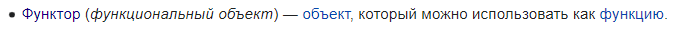

## &nbsp;&nbsp;&nbsp;&nbsp;15. C++.  Функциональные   объекты и лямбда-выражения.
### &nbsp;&nbsp;&nbsp;&nbsp;Функциональные объекты  
>**ФО** – класс, в котором перегружена операция вызова функции (). Вызов ОФ: «имя_класса()». Если возвращаемое значение ОФ имеет тип bool, то ОФ называется предикатом. Предикат используется в качестве параметра алгоритма; алгоритм в качестве аргумента выбирает из контейнера объект, удовлетворяющий ФО.  

&nbsp;&nbsp;&nbsp;&nbsp;*это любой тип, реализующий operator(). Этот оператор называется оператором вызова или иногда оператором приложения. Стандартная библиотека C++ использует объекты функций главным образом в качестве критериев сортировки для контейнеров и в алгоритмах.*

&nbsp;&nbsp;&nbsp;&nbsp;Объекты функций обеспечивают два основных преимущества по сравнению с прямым вызовом функций. Во-первых, объект функции может содержать состояние. Во-вторых, объект функции является типом и поэтому может использоваться в качестве параметра шаблона.

#### &nbsp;&nbsp;&nbsp;&nbsp;Создание объекта функции

*Чтобы создать объект функции, создайте тип и реализуйте operator(), например:*  

```
class Functor
{
public:
    int operator()(int a, int b)
    {
        return a < b;
    }
};

int main()
{
    Functor f;
    int a = 5;
    int b = 7;
    int ans = f(a, b);
}
```

--- 

### &nbsp;&nbsp;&nbsp;&nbsp;Лямбда-выражения
>**Лямбда-функция** представляет собой блок кода, который рассматривается как определение безымянной (анонимной) функции. Формат для С++ (упрощенный): [] (список параметров) -> тип_возвращаемого_значения { инструкции} Этот блок можно использовать в качестве параметра алгоритма.

*Лямбда-выражениями называются безымянные локальные функции, которые можно создавать прямо внутри какого-либо выражения.*

&nbsp;&nbsp;&nbsp;&nbsp;Первое, что следует уяснить: лямбда-выражения в C++ — это краткая форма записи анонимных функторов.  

&nbsp;&nbsp;&nbsp;&nbsp;Рассмотрим пример:
```
// Листинг 1
#include <algorithm>
#include <cstdlib>
#include <iostream>
#include <vector>
 
using namespace std;
 
int main()
{
	vector<int> srcVec;
	for (int val = 0; val < 10; val++)
	{
		srcVec.push_back(val);
	}
 
	for_each(srcVec.begin(), srcVec.end(), [](int _n)
	{
		cout << _n << " ";
	});
	cout << endl;
 
	return EXIT_SUCCESS;
}

```
&nbsp;&nbsp;&nbsp;&nbsp;Фактически данный код целиком соответствует такому:
```
// Листинг 2
#include <algorithm> 
#include <cstdlib> 
#include <iostream> 
#include <vector>
 
using namespace std;
 
class MyLambda 
{
	public: void operator ()(int _x) const { cout << _x << " "; } 
};
 
int main() 
{
	vector<int> srcVec; 
	for (int val = 0; val < 10; val++)
	{ 
		srcVec.push_back(val); 
	}
 
	for_each(srcVec.begin(), srcVec.end(), MyLambda()); 
	cout << endl;
 
	return EXIT_SUCCESS; 
}

```
&nbsp;&nbsp;&nbsp;&nbsp;Вывод соответственно будет следующим:
>0 1 2 3 4 5 6 7 8 9

&nbsp;&nbsp;&nbsp;&nbsp;На что здесь стоит обратить внимание. Во-первых, из Листинга 1 мы видим, что лямбда-выражение всегда начинается с [] , затем идет необязательный список параметров, а затем непосредственно тело функции. Во-вторых, тип возвращаемого значения мы не указывали, и по умолчанию лямбда возвращает void. В-третьих, как видно по Листингу 2, по умолчанию генерируется константный метод.

>*еще про это много чего написано по 2 ссылке*

--- 

##### полезные ссылки

>+ [первая](https://learn.microsoft.com/ru-ru/cpp/standard-library/function-objects-in-the-stl?view=msvc-170)
>+ [вторая](https://habr.com/ru/post/66021/)