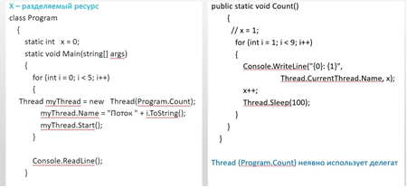

## &nbsp;&nbsp;&nbsp;&nbsp;С#. Многопоточность. Разделяемые ресурсы.
### &nbsp;&nbsp;&nbsp;&nbsp;Многопоточность

>&nbsp;&nbsp;&nbsp;&nbsp;Ключевым понятием при работе с многопоточностью является поток. Поток предствляет некоторую часть кода программы. При выполнении программы каждому потоку выделяется определенный квант времени. **И при помощи многопоточности мы можем выделить в приложении несколько потоков, которые будут выполнять различные задачи одновременно.** Если у нас, допустим, графическое приложение, которое посылает запрос к какому-нибудь серверу или считывает и обрабатывает огромный файл, то без многопоточности у нас бы блокировался графический интерфейс на время выполнения задачи. А благодаря потокам мы можем выделить отправку запроса или любую другую задачу, которая может долго обрабатываться, в отдельный поток. Поэтому, к примеру, клиент-серверные приложения (и не только они) практически не мыслимы без многопоточности.

&nbsp;&nbsp;&nbsp;&nbsp;Основной функционал для использования потоков в приложении сосредоточен в пространстве имен System.Threading. В нем определен класс, представляющий отдельный поток - класс Thread.  

&nbsp;&nbsp;&nbsp;&nbsp;Класс Thread определяет ряд методов и свойств, которые позволяют управлять потоком и получать информацию о нем. Основные свойства класса:

+ **ExecutionContext**: позволяет получить контекст, в котором выполняется поток
+ **IsAlive:** указывает, работает ли поток в текущий момент
+ **IsBackground**: указывает, является ли поток фоновым
+ **Name**: содержит имя потока
+ **ManagedThreadId**: возвращает числовой идентификатор текущего потока
+ **Priority**: хранит приоритет потока - значение перечисления ThreadPriority:
+ **ThreadState** возвращает состояние потока - одно из значений перечисления ThreadState:

>&nbsp;&nbsp;&nbsp;&nbsp;Когда один и тот же ресурс используется в разных местах, то фактически мы используем один и тот же объект. Однако это не всегда желательно. Иногда необходимо, чтобы примение ресурса к разным объектам различалось. То есть нам необходимо, чтобы при каждом применении создавался отдельный объект ресурса.  

