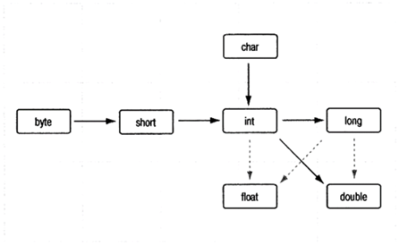

## &nbsp;&nbsp;&nbsp;&nbsp;Java: Типы данных.
>&nbsp;&nbsp;&nbsp;&nbsp;В джава типы данных делятся на две категории: встроенные (примитивные) и ссылочные

#### &nbsp;&nbsp;&nbsp;&nbsp;Встроеные(примитивные):

+ **Boolean**	true или false
+ **Byte**	хранит целое число от -128 до 127 и занимает 1 байт  
+ **Short**	хранит целое число от -32768 до 32767 и занимает 2 байта  
+ **Int**	-2147483648 до 2147483647 и занимает 4 байта   
+ **Long**	целое число занимает 8 байт  
+ **Double**	число с плавающей точкой от ±4.9*10324 до ±1.8*10308 и занимает 8 байт. В качестве разделителя целой и дробной части в дробных литералах используется точка  
+ **Float**	число с плавающей точкой 4 байта  

#### Приведение типов:
 

#### Операции над числовыми множествами:  

+ **Классические операции** +-*/
+ **Остаток** %	
+ **Укороченное а=а+1**+=, *=, /=,-=	
+ **+=1, -=1** ++, --	
+ **Сравнение** ==, !=, <>, <=, >=	
+ **ИЛИ** &&, ||	И, 
+ **Тернарные операции** &, |, ^, ~	И, ИЛИ, исключающее ИЛИ, НЕ
+ **Сдвиги** >>, <<, >>>>  

#### Ссылочный тип:
&nbsp;&nbsp;&nbsp;&nbsp;Ссылочные переменные хранят адрес ячейки памяти, в которой расположен определенный объект. То есть это “визитка” с адресом, имея которую мы можем найти наш объект в общей памяти и выполнять с ним некоторые манипуляции.
Проще говоря, ссылочный тип это все типы данных кроме примитивных (любой инстанцируемый класс, а также массивы: String, Scanner, Random, HashMap, ListOf и тд)
