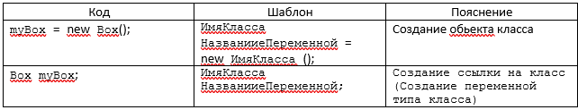

## &nbsp;&nbsp;&nbsp;&nbsp;Java. Классы, создание объектов.
>&nbsp;&nbsp;&nbsp;&nbsp;**Класс в Java** - это шаблон для создания объекта, а объект - это экземпляр класса. Класс определяет структуру и поведение, которые будут совместно использоваться набором объектов. Класс содержит переменные и методы, которые называются элементами класса, членами класса. Он составляет основу инкапсуляции в Java. Каждый объект данного класса содержит структуру и поведение, которые определены классом. Иногда объекты называют экземплярами класса.

+ Есть: поля, методы, конструкторы  
+ Нет: конструкторов копирования, деструкторов, перегрузки операций, слова «virtual», свойств  
+ Есть: указатель this, автоматическая инициализация полей: примитивные 0, ссылочные null  
### Модификаторы доступа
+ &nbsp;&nbsp;&nbsp;&nbsp;public: публичный, общедоступный класс или член класса. Поля и методы, объявленные с модификатором public, видны другим классам из текущего пакета и из внешних пакетов.
+ &nbsp;&nbsp;&nbsp;&nbsp;private: закрытый класс или член класса
+ &nbsp;&nbsp;&nbsp;&nbsp;protected: такой класс или член класса доступен из любого места в текущем классе или пакете или в производных классах, даже если они находятся в других пакетах
+ &nbsp;&nbsp;&nbsp;&nbsp;Модификатор по умолчанию. Отсутствие модификатора у поля или метода класса предполагает применение к нему модификатора по умолчанию. Такие поля или методы видны всем классам в текущем пакете.
```
class ИмяКласса{

       тип переменнаяЭкземпляра1;
       тип переменнаяЭкземпляра2;
         // ...
       тип переменнаяЭкземпляраN;

      тип имяМетода 1 ( список параметров) {
         // тело метода
       }
       тип имяМетода2 (список параметров) {
         // тело метода
        }
       …
      тип имяМетодаN (список  параметров ) {
        // тело метода
       }
}
```
